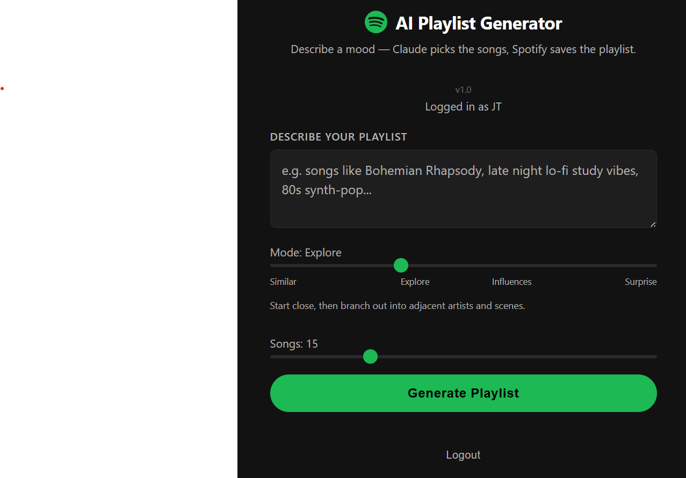

 
 # Claude Spotify Playlist Generator

Generate Spotify playlists from a seed track or artist using Claude AI and Last.fm. Enter a song or artist, pick a discovery mode, and get a verified playlist saved directly to your Spotify account.

<p align="center">
  
</p>

## What it does

1. Enter a seed — an artist (`Radiohead`), a track (`Soft Cell - Tainted Love`), a blend (`Radiohead + Aphex Twin`), or a mood description (`late night melancholic electronic`)
2. Pick a discovery mode to control how adventurous the recommendations are
3. Last.fm fetches real similar tracks, similar artists, and genre tags for the seed
4. Claude AI ranks the best matches from the candidate pool — it cannot invent songs
5. Each track is verified on Spotify before being included
6. Preview the list, name the playlist, and save it to your Spotify account

## Features

- **4 discovery modes** — Similar, Explore, Influences, Surprise
- **Blend mode** — combine two artists (e.g. `Radiohead + Aphex Twin`) to find the sonic overlap
- **Mood-only mode** — no seed required, describe a feeling or vibe and Claude builds the pool from Last.fm genre tags
- **Show reasons** — optional toggle to show why each track was picked
- **Token display** — shows Claude input/output token counts per generation
- **Spotify-verified results** — every track is confirmed to exist on Spotify before being shown

## Discovery modes

| Mode | Behaviour |
|---|---|
| **Similar** | Tracks that sound very close to the seed — same mood, instrumentation, and energy |
| **Explore** | Starts close, then branches into adjacent artists, subgenres, and scenes |
| **Influences** | Traces the musical lineage — artists and songs that shaped the seed's sound |
| **Surprise** | Unexpected connections that still make musical sense |

## How the pipeline works

```
Seed (artist + optional track)
        │
        ▼
Last.fm ──► track.getSimilar      (up to 25 similar tracks)
        ├── track.getTopTags      (genre/mood tags)
        ├── artist.getSimilar     (up to 10 similar artists)
        └── artist.getTopTracks  (top 3 tracks per similar artist)
        │
        ▼
Candidate pool (30–40 tracks, deduplicated)
        │
        ▼
Claude Haiku ──► ranks top 20 candidates by mode
        │
        ▼
Spotify search ──► verifies each track sequentially
        │
        ▼
First 15 verified tracks → saved as playlist
```

Claude only selects from the Last.fm candidate pool — it cannot hallucinate or invent songs.

## Tech stack

- **Backend** — Python, [FastAPI](https://fastapi.tiangolo.com/), [httpx](https://www.python-httpx.org/)
- **AI** — [Anthropic Claude](https://www.anthropic.com/) (`claude-haiku-4-5-20251001`) for ranking
- **Music data** — [Last.fm API](https://www.last.fm/api) for candidate track discovery
- **Auth** — Spotify OAuth 2.0, signed session cookies (no database required)
- **Frontend** — Vanilla HTML/CSS/JS (no framework)
- **Hosting** — [Render](https://render.com/)

## Prerequisites

- Python 3.11+
- A [Spotify Developer](https://developer.spotify.com/dashboard) account and app
- An [Anthropic API](https://console.anthropic.com/) key
- A [Last.fm API](https://www.last.fm/api/account/create) key (free)

## Local setup

1. **Clone the repo**

   ```bash
   git clone https://github.com/JTYEG/spotify-ai-playlist.git
   cd spotify-ai-playlist
   ```

2. **Install dependencies**

   ```bash
   pip install -r requirements.txt
   ```

3. **Configure environment variables**

   Copy `.env.example` to `.env` and fill in your keys:

   ```bash
   cp .env.example .env
   ```

   | Variable | Where to get it |
   |---|---|
   | `ANTHROPIC_API_KEY` | [console.anthropic.com](https://console.anthropic.com/) |
   | `SPOTIFY_CLIENT_ID` | Spotify Developer Dashboard |
   | `SPOTIFY_CLIENT_SECRET` | Spotify Developer Dashboard |
   | `SPOTIFY_REDIRECT_URI` | Set to `http://localhost:8000/callback` locally |
   | `LASTFM_API_KEY` | [last.fm/api/account/create](https://www.last.fm/api/account/create) |
   | `SECRET_KEY` | Any long random string (used to sign session cookies) |

4. **Add the redirect URI to your Spotify app**

   In your Spotify Developer Dashboard → your app → Edit Settings → Redirect URIs, add:
   ```
   http://localhost:8000/callback
   ```

5. **Run the server**

   ```bash
   uvicorn main:app --reload
   ```

   Open [http://localhost:8000](http://localhost:8000) in your browser.

## Deployment

See [DEPLOY.md](DEPLOY.md) for instructions on deploying to Render.

## Project structure

```
├── main.py              # FastAPI app — routes, Last.fm pipeline, Claude ranking, Spotify auth
├── static/
│   ├── index.html       # Single-page UI
│   ├── app.js           # Frontend logic
│   └── style.css        # Styles
├── docs/
│   └── screenshot.png   # App screenshot
├── requirements.txt
├── .env.example         # Environment variable template
└── Procfile             # For Render deployment
```

## License

MIT
